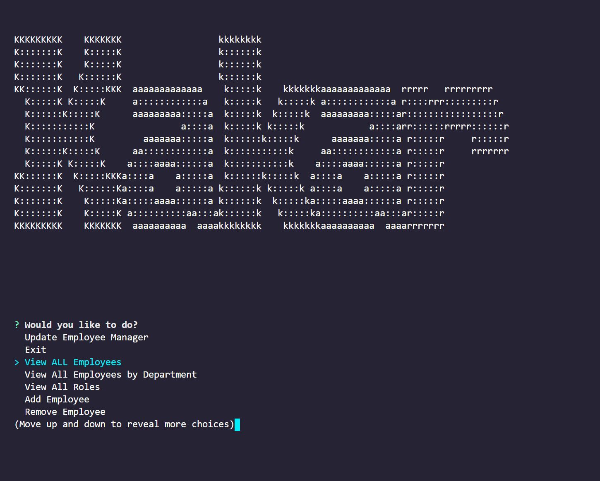
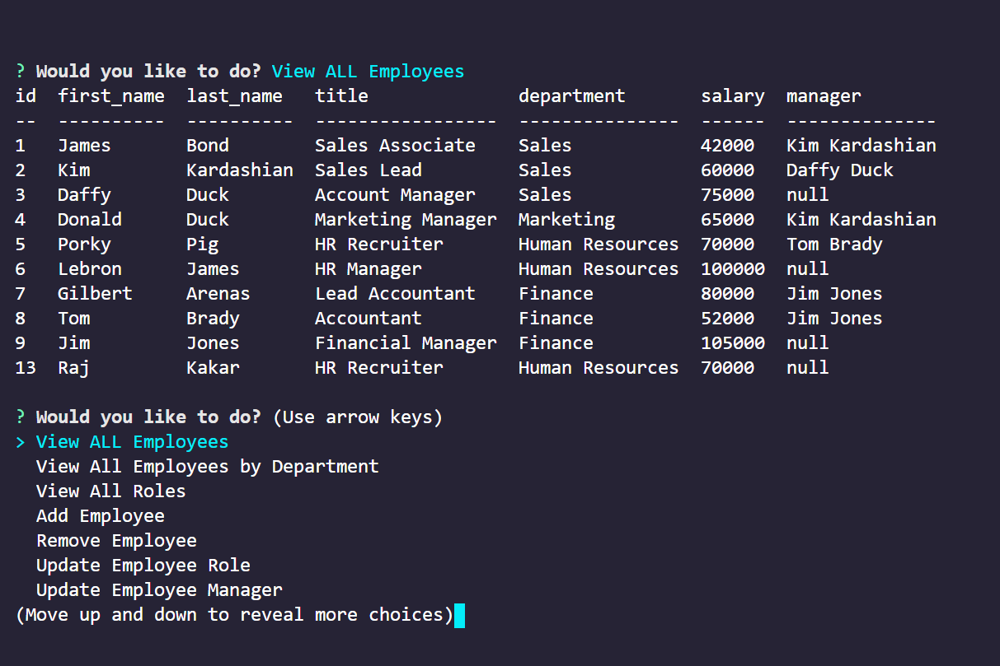
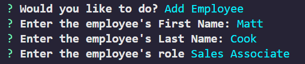
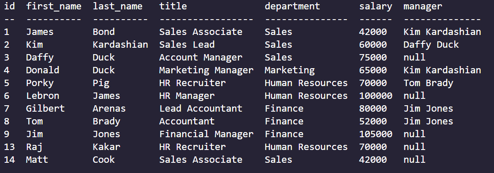
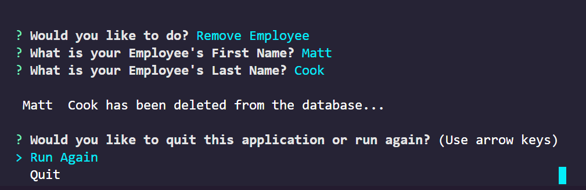

# EmployeeTracker

## Table of Contents

- [Description](#Description)
- [Tools_Used](#Tools_Used)
- [Links](#Links)
- [Application-Screen-Shots](#Application-Screen-Shots)
- [Credits](#Credits)

## Description

The EmployeeTracker is a CLI application that allows a companies user to keep track of it's employees. The application allows users to view the list of current employees and their pertinent information such as role, department, salary, and assigned managers. Additionally, the application allows for the following functionality:

- View employees by department
- View all roles
- Add employees
- Remove employees
- Update employee manager

## Tools Used

- JavaScript
- mySQL
- NPM inquirer
- Console Table
- Figlet

## Links (Application & Repo)

EmployeeTracker can be accessed at github link provided below:

Github Repository: <https://github.com/rajdeep24/EmployeeTracker>

Video Link: <https://drive.google.com/file/d/1bXkcMtujp0WI6tyYj4mK6cmvUtnfRB5O/view>

### Screenshots

#### Homepage

#### View all Employees

#### View Employees by dept

#### Add Employee

#### Remove Employee

## Credits

I would like to credit georgia tech's coding bootcamp and the support from my peers.

## Badges

